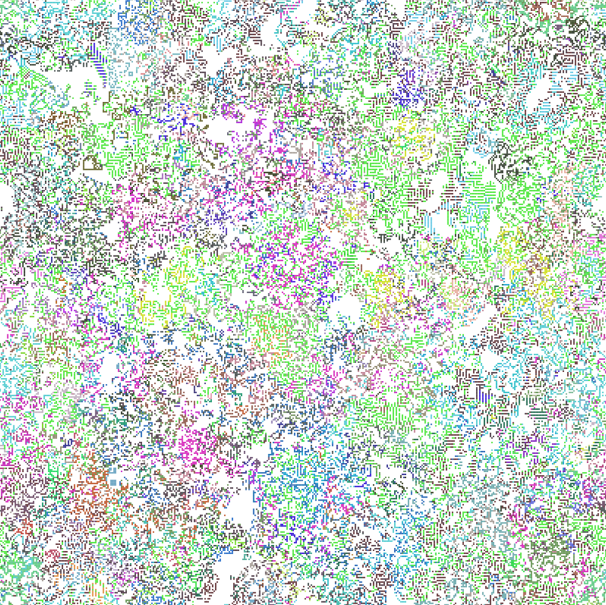
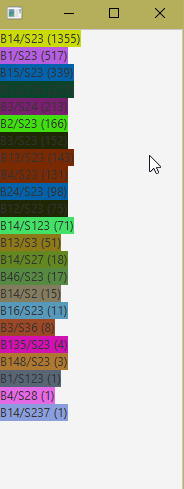

Game of Life + Evolution
---
A simple modification of [Conway's Game of Life](https://en.wikipedia.org/wiki/Conway%27s_Game_of_Life) where cells can 
mutate and compete with each other via natural selection, similar to life evolving in the real world.

When a cell reproduces, its rule has a small chance to mutate and modify the conditions it needs to stay alive or 
propagate into new tiles. When two cells of different rules try to spread into a new tile, they will "fight" each other 
and the one with the least permissive rule will win. I.e. B3/S23 will win against B34/S23, because the latter is better 
at moving into empty tiles. This creates a trade-off where the rules better at spreading across the board will be worse 
at directly competing with their living neighbors, and vice versa. 

This mimics a producer-predator-prey cycle from real life, where plants will directly receive all the sun's energy, 
then some will be eaten by and have their energy passed on to herbivores, which will then be hunted by predators. In 
this app, the producers and herbivores are like the fast-propagating cells that spread easily on empty space, then the 
predators are like the rules with weak propagation that spread by overtaking their neighbors.

# Usage
Running the app will automatically show the main view window and the population window. Cells will show up in the main 
as they would in the standard Conway's Game of Life. Cells are randomly color coded by their rule. There is currently 
no way to directly interact with it once it is running; simply watch the cells spread and evolve on their own.

The initial parameters can be changed by modifying Main.kt.

The population view shows all the cell rules currently present in the world, sorted by their population total.

